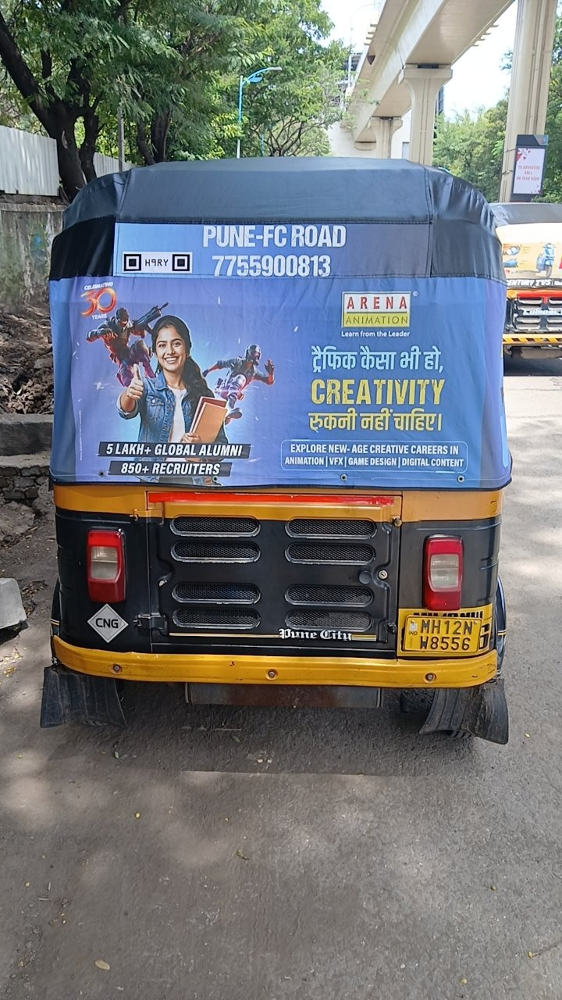
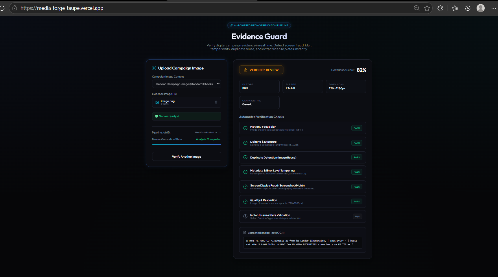

# MediaForge: Asynchronous Image Verification Pipeline

MediaForge is an asynchronous image-evidence verification pipeline designed for offline campaign execution. When field workers upload campaign images as evidence, the system processes them asynchronously in the background to analyze image quality, detect duplicates, perform OCR, check for suspicious tampering heuristics, and calculate an overall confidence score and verdict. The pipeline is designed for generic campaign-image intake and is not limited to vehicle verification.

---

## 1. Overview
In offline marketing campaigns, validating execution depends heavily on photos uploaded by field workers as evidence of completion (e.g., verifying that a banner or vehicle branding was correctly placed). Doing this manually at scale is slow, prone to errors, and expensive. 

MediaForge automates the ingestion and verification of these images. Because image analysis (OpenCV calculations, OCR character extraction, and perceptual hashing queries) can be resource-intensive and slow, the pipeline operates **asynchronously**:
- The API accepts uploads and immediately returns an ingestion ticket (status `pending`).
- A background worker picks up the job via a Redis-backed queue.
- A Python analyzer microservice performs heuristic checks and stores structured results.
- The pipeline processes both specialized vehicle images (with number-plate validation) and generic campaign images (which return number-plate status as `not_applicable`).

---

## 2. Problem Context
Validating field evidence involves detecting common quality issues and deceptive practices:
- **Blurry Images:** Out-of-focus photos prevent readable text/details (e.g., verifying campaign content or vehicle registration plates).
- **Dark/Bright Images:** Poor exposure or night shots obscure detail and make verification impossible.
- **Duplicate Uploads:** Re-submitting the same photo across different campaign spots or jobs represents execution fraud.
- **Screenshots / Photo-of-Photo:** Field workers sometimes upload screenshots or take photos of other screens/physical prints to simulate on-site execution.
- **Tampered Images:** Digitally manipulated images (e.g., photoshopping banners onto spots) compromise execution integrity.

MediaForge implements robust analysis to detect these indicators, enabling manual reviewers to focus only on questionable uploads.

---

## 3. Key Features
- **Asynchronous Processing:** Multi-service orchestration using Redis and BullMQ for responsive API uploads.
- **Blur Detection:** Laplacian variance check to isolate out-of-focus submissions.
- **Brightness Evaluation:** Color-space analysis to flag overexposed or underexposed photos.
- **Perceptual Hashing (pHash):** Perceptual similarity queries in PostgreSQL to flag duplicate or modified images.
- **OCR Text Extraction:** Tesseract-OCR integration to read and search text within campaign images.
- **Indian Vehicle Plate Validation:** Dynamic format and state-code checks matching Indian registration standards.
- **Dimensions Check:** Aspect ratio and resolution verification to block low-quality files.
- **Screen Capture/Photo-of-Photo Detection:** Heuristics checking for flat-color distributions, camera EXIF absence, and frame borders.
- **Tampering Heuristic:** Error Level Analysis (ELA) to flag local compression anomalies in manipulated files.
- **Automatic Analyzer Cold-Start Handling:** Backend client automatically ping-checks and wakes Render-hosted services before processing.
- **Structured Results & Confidence Score:** Normalized per-check metrics and overall review verdicts.

---

## 4. Architecture
```text
                  [ Client / Frontend ]
                           │
                           ▼ (POST /api/v1/images)
              [ Node.js + Express backend ]
               │                         │
               ▼                         ▼
      [ PostgreSQL DB ]          [ Redis + BullMQ ]
      (Stores Image/Job              (Job Queue)
          Metadata)                      │
                                         ▼
                               [ Background Worker ]
                                         │
                                         ▼ (POST /analyze)
                            [ Python FastAPI Analyzer ]
                                         │
                 ┌───────────────────────┼───────────────────────┐
                 ▼                       ▼                       ▼
            [ OpenCV ]            [ Tesseract OCR ]      [ Image Heuristics ]
       (Blur/Brightness/ELA)    (Text/Plate Patterns)   (Photo-of-Photo/pHash)
                                         │
                                         ▼
                            [ Analysis Results DB Table ]
                                         │
                                         ▼ (GET /images/:id/results)
                                  [ Client UI ]
```

---

## 5. Processing Flow
1. **Upload:** Client uploads an image with an optional `imageType` via `POST /api/v1/images`.
2. **Ingest & Validate:** Backend checks file limits/MIME types, saves the file to local/object storage, and inserts a row in the `images` table.
3. **Queue Job:** A job row is created in `processing_jobs` (status `pending`), and a BullMQ job is enqueued in Redis. The API immediately returns `202 Accepted` with the `processingId`.
4. **Acquire & Process:** The background worker picks up the job, changes its status to `processing`, and calls the Python analyzer.
5. **Wake & Analyze:** 
   - The backend analyzer client checks if the Python service is active by calling `${ANALYZER_BASE_URL}/health`.
   - If the analyzer is sleeping (cold-starting on Render), it retries and waits until it is ready.
   - The backend sends the image as a multipart POST payload (using fixed-buffer and content-length) to `/analyze`.
6. **Heuristics & pHash:** The analyzer runs OpenCV, OCR, and EXIF checks. Perceptual duplicate detection is run by the backend querying Postgres for hamming distances.
7. **Verdict & Complete:** Check details are saved to `analysis_results`, overall confidence is calculated, and the job status is set to `completed` in `processing_jobs`.

### Retries & Failure Handling
- **Transient Failures:** Connection drops, timeouts, 502/503/504 errors on health or analyze calls trigger up to 3 automatic retries with backoff.
- **Permanent Failures:** Client errors (400), corrupt files, or code errors do not retry, immediately setting the job status to `failed` with the error reason stored in the database.

---

## 6. Tech Stack
- **API & Worker:** Node.js, TypeScript, Express, Multer
- **Queue System:** Redis, BullMQ
- **Relational DB:** PostgreSQL, pg (node-postgres)
- **Analyzer API:** Python, FastAPI, Uvicorn
- **Image Processing & CV:** OpenCV (opencv-python), Pillow (PIL)
- **Text Recognition:** Tesseract OCR (pytesseract)
- **Testing:** Jest, Supertest (Node.js), Pytest (Python)
- **Containerization:** Docker, Docker Compose

---

## 7. Image Analysis Checks
- **Blur:** Calculates the variance of the Laplacian. Low variance indicates blur. Refined to classify low-edge-density but sharp images (e.g. screenshots with flat backgrounds) as `warning` instead of `fail` by checking the maximum absolute gradient.
- **Brightness:** Analyzes the mean pixel intensity in the grayscale channel to detect under-exposed (`too_dark`) or over-exposed (`too_bright`) environments.
- **Duplicate:** Computes an 8-byte perceptual hash (pHash) of the image. The backend compares this hash against previous hashes using Hamming distance.
- **OCR:** Uses Tesseract to extract alphanumeric text strings from the image.
- **Number Plate:** If the image is marked as `vehicle`, matches OCR text against standard regex patterns for Indian registration plates (e.g., `MH12AB1234`) and checks valid state codes.
- **Dimensions:** Validates resolution (minimum 800x600px) and checks for unusual aspect ratios.
- **Photo-of-Photo:** A heuristic checking for a combination of flat-region ratios (screen glow), lack of camera EXIF metadata, and rectangular screen borders.
- **Tampering:** Performs Error Level Analysis (ELA) by saving the image at a specific quality level, computing the difference, and analyzing pixel standard deviation to flag composite edits.

*Note: These are heuristic, probabilistic checks intended to surface potential risk signals for human review. They do not represent definitive forensic guarantees.*

---

## 8. Generic Image Support
MediaForge is fully generalized to support any campaign evidence images:
- **Generic Checks:** Blur, brightness, dimensions, duplicate, photo-of-photo, and tampering heuristics apply globally to all uploads.
- **Conditional Plate Check:** Vehicle number-plate validation only runs if `imageType` is set to `"vehicle"`.
- **Skip Behavior:** For non-vehicle images (e.g., banner photos, shop branding), the number-plate check is bypassed, returning status `"not_applicable"`.
- **Triage Safety:** A `"not_applicable"` check status does not lower the confidence score or affect the overall verdict.

---

## 9. Verdict Logic
The overall job verdict is determined by combining the individual check statuses and the calculated confidence score:
- **`usable`:** Returned when all quality checks pass successfully and the confidence score is high ($\ge 0.65$).
- **`review`:** Returned if any quality check fails or returns a warning, or if the overall confidence score falls below $0.65$.
- **No Automatic Rejections:** To prevent false rejections from blocking legitimate campaigns, the pipeline never automatically marks a job as `rejected`. Any candidate for rejection is instead categorized as `review` so a human operator can make the final determination.

---

## 10. API Documentation

### 1. Ingest Campaign Image
`POST /api/v1/images`

Uploads an image file to start the verification process.

- **Request Type:** `multipart/form-data`
- **Headers:** `Content-Type: multipart/form-data`
- **Body Parameters:**
  - `image` (File, Required): The JPEG/PNG/WebP image.
  - `imageType` (String, Optional): Options: `generic` (default), `vehicle`.
- **Response:** `202 Accepted`

**Example Request:**
```bash
curl -X POST http://localhost:3000/api/v1/images \
  -F "image=@/path/to/evidence.jpg" \
  -F "imageType=vehicle"
```

**Example Response:**
```json
{
  "processingId": "1a2b3c4d-5e6f-7a8b-9c0d-1e2f3a4b5c6d",
  "status": "pending"
}
```

---

### 2. Get Job Status
`GET /api/v1/images/:processingId/status`

Retrieves the current status of the background verification job.

- **Response:** `200 OK`

**Example Response:**
```json
{
  "processingId": "1a2b3c4d-5e6f-7a8b-9c0d-1e2f3a4b5c6d",
  "status": "processing",
  "attempts": 1,
  "errorMessage": null,
  "startedAt": "2026-08-13T12:00:00.123Z",
  "completedAt": null,
  "createdAt": "2026-08-13T11:59:55.456Z"
}
```

---

### 3. Get Verification Results
`GET /api/v1/images/:processingId/results`

Retrieves detailed check results once the job is in the `completed` state.

- **Response:** `200 OK`

**Example Response:**
```json
{
  "processingId": "1a2b3c4d-5e6f-7a8b-9c0d-1e2f3a4b5c6d",
  "imageId": "9f8e7d6c-5b4a-3f2e-1d0c-9b8a7f6e5d4c",
  "status": "completed",
  "overallStatus": "review",
  "confidence": 0.42,
  "filename": "1a2b3c4d-5e6f-7a8b.jpg",
  "originalName": "evidence.jpg",
  "mimeType": "image/jpeg",
  "fileSizeBytes": 81354,
  "width": 800,
  "height": 600,
  "imageType": "generic",
  "ocrText": "CAMPAIGN ACTIVE",
  "checks": {
    "blur": {
      "status": "pass",
      "score": 1.0,
      "laplacianVariance": 1340.1,
      "message": "Image sharpness is acceptable (variance: 1340.1)",
      "method": "laplacian_variance"
    },
    "brightness": {
      "status": "pass",
      "score": 0.9,
      "meanBrightness": 128.4,
      "classification": "acceptable",
      "message": "Lighting is acceptable"
    },
    "duplicate": {
      "status": "pass",
      "score": 1.0,
      "isDuplicate": false,
      "closestMatchImageId": null,
      "hammingDistance": null,
      "similarity": null
    },
    "ocr": {
      "status": "pass",
      "score": 0.9,
      "text": "CAMPAIGN ACTIVE",
      "message": "Text successfully extracted."
    },
    "numberPlate": {
      "status": "not_applicable",
      "message": "Number plate detection is only performed for vehicle images."
    },
    "dimensions": {
      "status": "pass",
      "score": 1.0,
      "width": 800,
      "height": 600,
      "aspectRatio": 1.33,
      "fileSizeBytes": 81354,
      "mimeType": "image/jpeg",
      "issues": []
    },
    "photoOfPhoto": {
      "status": "warning",
      "score": 0.33,
      "suspicious": true,
      "heuristic": true,
      "signals": {
        "hasCameraExif": false,
        "hasRectangularFrameBorder": false,
        "flatRegionRatio": 0.7
      },
      "message": "Possible screen capture detected (2/3 signals triggered)."
    },
    "tampering": {
      "status": "pass",
      "score": 0.89,
      "suspicious": false,
      "heuristic": true,
      "method": "error_level_analysis",
      "elaStdDev": 3.29,
      "elaMeanDiff": 1.41,
      "message": "No tampering indicators detected."
    }
  },
  "createdAt": "2026-08-13T11:59:55.456Z"
}
```

---

### 4. Health Check
`GET /health`

Checks database connectivity status.

- **Response:** `200 OK` (or `503 Service Unavailable` if degraded)

**Example Response:**
```json
{
  "status": "ok",
  "db": "up",
  "redis": "up",
  "timestamp": "2026-08-13T12:00:05.123Z"
}
```

---

## 11. Database Schema & Relationships
The database consists of three main tables:

```text
  ┌────────────────┐
  │     images     │
  └───────┬────────┘
          │ (1)
          │
          │ (1)
  ┌───────▼────────┐
  │processing_jobs │
  └───────┬────────┘
          │ (1)
          │
          │ (N)
  ┌───────▼────────┐
  │analysis_results│
  └────────────────┘
```

1. **`images`**: Stores metadata of the uploaded file.
   - `id` (UUID, Primary Key)
   - `original_filename` (Text)
   - `storage_path` (Text)
   - `mime_type` (Text)
   - `file_size` (Int)
   - `width`, `height` (Int, Nullable)
   - `phash` (Varchar, Nullable)
   - `image_type` (Text)
   - `created_at` (Timestamp)

2. **`processing_jobs`**: Coordinates the lifecycle of background analysis tasks.
   - `id` (UUID, Primary Key)
   - `image_id` (UUID, Foreign Key referencing `images.id`)
   - `status` (`pending`, `processing`, `completed`, `failed`)
   - `overall_status` (`usable`, `review`, `rejected`)
   - `confidence` (Numeric, Nullable)
   - `attempts` (Int)
   - `error_message` (Text, Nullable)
   - `started_at`, `completed_at`, `created_at` (Timestamp)

3. **`analysis_results`**: Stores the granular status and metrics for individual checks.
   - `id` (UUID, Primary Key)
   - `job_id` (UUID, Foreign Key referencing `processing_jobs.id`)
   - `check_type` (`blur`, `brightness`, `duplicate`, `ocr`, `numberPlate`, `dimensions`, `photoOfPhoto`, `tampering`)
   - `status` (`pass`, `warning`, `fail`, `not_applicable`)
   - `score` (Numeric, Nullable)
   - `result` (JSONB)
   - `created_at` (Timestamp)

---

## 12. Queue and Worker Architecture
MediaForge uses **BullMQ** built on top of **Redis** to run heavy computational tasks in the background:
- **API Decoupling:** Express routes insert files and return immediately, preventing client HTTP request timeouts.
- **Worker Execution:** The worker is implemented as a standalone Node.js process (`src/workers/imageProcessing.worker.ts`). It handles concurrency control, fetches job specifications, and manages execution.
- **Failures & Backoff:** If the analyzer fails temporarily, BullMQ automatically retries the job up to 3 times with exponential backoff (starting at a 2-second delay).
- **Graceful Termination:** If all retries are exhausted, `handleJobExhausted` changes the job status in Postgres to `failed` and records the detailed stack trace.

---

## 13. Project Structure
```text
MediaForge/
├── analyzer/                  # Python FastAPI Analyzer Service
│   ├── app/
│   │   ├── checks/            # Individual check services (blur, ELA, ocr...)
│   │   │   ├── blur.py
│   │   │   └── tampering.py
│   │   ├── services/          # Image loading and execution pipeline
│   │   └── main.py            # API entry point
│   ├── tests/                 # Python unit tests
│   ├── Dockerfile
│   └── requirements.txt
├── backend/                   # Node.js + Express API & Worker Service
│   ├── src/
│   │   ├── config/            # DB, Redis, and environment configs
│   │   ├── controllers/       # Route request handlers
│   │   ├── middleware/        # Input validation and uploads
│   │   ├── repositories/      # Database access layers
│   │   ├── routes/            # Express route mapping
│   │   ├── services/          # Business logic & analyzer HTTP client
│   │   ├── utils/             # Winston logger setup
│   │   └── workers/           # BullMQ worker process
│   ├── tests/                 # Node.js Jest tests
│   ├── tsconfig.json
│   └── package.json
├── database/
│   └── migrations/            # SQL Schema migration files
├── images/                    # GoGig sample inputs and output screenshots
├── samples/                   # Sample images used for verification
├── docker-compose.yml         # Container orchestration
└── README.md
```

---

## 14. Setup & Running Local Environment

### Prerequisites
- Docker and Docker Desktop installed.

### Environment Setup
Create a `.env` file in the root directory by cloning `.env.example`:
```bash
cp .env.example .env
```

The system will read the database credentials from the `.env` file and synchronize the PostgreSQL container credentials with the backend.

### Running with Docker Compose
To start the entire network stack (Postgres, Redis, Analyzer, Backend, and Worker):
```bash
docker compose up --build
```

**Local Ports Exposed:**
- Backend API: `http://localhost:3000`
- Python Analyzer: `http://localhost:8000`
- PostgreSQL Database: `localhost:5432`
- Redis Queue Server: `localhost:6379`

---

## 15. Run Tests & Build
To build and verify the services locally:

### 1. Build and Run Backend Tests
Ensure you have Redis and Postgres running, then inside the `backend` folder:
```bash
cd backend
npm install
npm run build
npm test
```
*Verification: Confirms all 31 Express API and worker integration tests pass.*

### 2. Run Python Analyzer Tests
Inside the `analyzer` folder:
```bash
cd analyzer
python -m venv .venv
source .venv/bin/activate    # Windows: .venv\Scripts\activate
pip install -r requirements.txt
pytest
```
*Verification: Confirms all 23 CV, OCR, and API unit tests pass.*

---

## 16. GoGig Sample Image Results

The following are the actual sample images provided for the assignment and the corresponding outputs generated by the verification pipeline.

### Sample 1

**Input**

.png)

**Analysis Output**

output.png)

---

### Sample 2

**Input**

.png)

**Analysis Output**

output.png)

---

### Sample 3

**Input**



**Analysis Output**



---

## 17. Architecture Trade-offs
- **Queue Engine (Redis + BullMQ vs. RabbitMQ/Kafka):** We chose Redis with BullMQ due to its lightweight nature and ease of orchestration in a containerized Docker environment. It provides native retry support and rate limiting, avoiding the operational overhead of a heavy message broker like RabbitMQ or Kafka.
- **Storage Strategy (Local Filesystem vs. Object Storage):** For this assignment, files are stored on the local volume container. While an S3-compatible object store is standard for production, local filesystem storage keeps the Docker Compose setup completely self-contained and minimizes external network latency during processing.
- **Verification Logic (CV Heuristics vs. Custom ML Models):** We chose OpenCV calculations (Laplacian, ELA) and rule-based validation over heavy deep learning models. This ensures the analyzer runs with minimal CPU/memory overhead and remains extremely fast without requiring GPU environments.

---

## 18. Security Considerations
- **Secure Credentials:** The system uses standard environment variable configurations (`.env`) for secrets management (Postgres credentials, database host, Redis URL). No secrets or database passwords are hardcoded or written to logs.
- **SSL Database Connections:** In production, the backend is configured to enforce SSL connections when connecting to Neon PostgreSQL, preventing eavesdropping and man-in-the-middle attacks.
- **Upload Validation:** The Express Multer layer implements strict validation on incoming uploads: enforcing maximum file size limits (10MB) and blocking unauthorized file MIME types to prevent denial-of-service and file execution vulnerabilities.

---

## 19. Future Improvements
- **Cloud Object Storage:** Transition image uploads to AWS S3 or Google Cloud Storage for persistent, durable, and horizontally scalable asset storage.
- **Authentication & Authorization:** Add API key verification or JWT authentication middleware to secure the upload and results retrieval endpoints.
- **Deep-Learning Classifiers:** Supplement basic CV heuristics (photo-of-photo, tampering) with lightweight deep-learning models (e.g. MobileNet/ResNet) to perform more robust screen and forgery detection.
- **Autoscaling Workers:** Scale worker containers horizontally inside a container orchestrator (like Kubernetes or Render Worker pools) to handle high-concurrency upload spikes.

---

## 20. AI Usage Disclosure
AI assistants were utilized during the development of this project:
- **Assisted Areas:** Structuring the multi-service architecture, writing unit tests for Express controllers and OpenCV logic, generating test assertions, implementing cold-start health retries, and drafting project documentation.
- **Human Verification:** All code modifications, database schemas, analysis pipelines, and custom logic were manually verified by running the test suites (`pytest` and `jest`) and validating local uploads end-to-end against real images. Thresholds, Docker configurations, and verdict policies were manually adjusted for assignment requirements.
